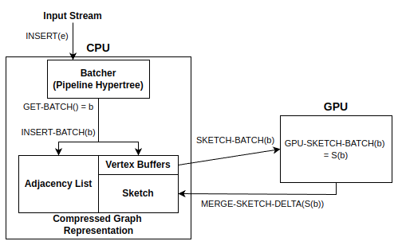

# GPUSketch: CUDA Library for Solving Connectivity and Minimum Cut on Graph Streams
Source code of GPUSketch: CPU/GPU heterogeneous system for high-performance graph sketching. Our paper on GPUSketch is in submission. 

## System Dataflow

1. Input graph is inserted into vertex-based batcher, referred as the pipeline hypertree.
2. Vertex-based batches are inserted into the compressed graph representation. Depending on a sketch algorithm (like the minimum cut), it may require storing the batches in the lossless representation (adjacency list).
3. For the vertex-based batches that need to be sketched, they get sent over to the GPU.
4. GPU performs sketch updates, generating delta sketches.
5. The delta sketches transfer back to the GPU, to be merged with the permanent state of sketches in the CPU. 

## Installing and Running GPUSketch
### Requirements
- Unix OS (not Mac, tested on Ubuntu)
- CUDA Toolkit (CUDA 11.8)
- cmake>=3.15

### Installation
Our project uses external libraries (like `VieCut`, `tlx`, and etc.) which may require downloading additional depedent libraries/packages.

1. Clone this repository
2. Create a `build` sub directory at the project root dir.
3. Initialize cmake by running `cmake ..` in the build dir. To include building other executables for tests and tools, run `cmake -DBUILD_TEST_AND_TOOL=ON ..`
4. Build the executables by running `make -j` in the build dir.

### Datasets
The datasets that we use for benchmark are currently not available publicly. For now, a small sample dataset for an input to the connected components problem is located in `test/res/multiples_graph_1024_stream.data`

### Main Executables
- `process_stream`: CPU-only graph skething solving the connected components problem.
- `cuda_process_stream`: CPU-GPU graph sketching solving the connected components problem.
- `min_cut`: CPU-GPU graph sketching with hybrid data structure solving the minimum cut problem.

### Executable Arguments
- `stream_file`: Input graph in binary stream format.
- `graph_workers`: Number of CPU threads processing edges in the pipeline hypertree and carrying out vertex-based batches.
- `reader_threads`: Number of CPU threads inserting edges from the graph stream into the pipeline hypertree.
- `no_edge_store`: (Minimum-Cut only) Flag for indicating to use the original min-cut sketch algorithm ([Ahn et al.](https://dl.acm.org/doi/10.1145/2213556.2213560)). `no` indicates using the hybrid data structure instead.
- `eps`: (Minimum-Cut only) Value for epsilon of the minimum cut approximation algorithm. 
- `export_mincut`: (Minimum-Cut only) Flag for generating an output text file with sampled minimum cut. 
- `[num_batch_per_buffer]` (Optional, only for CPU-GPU system) Number of vertex-based batches to store in a buffer in the CPU before sending to the GPU. The default value is `540`.

### Running Unit Tests
Run `./tests` from the build directory.
